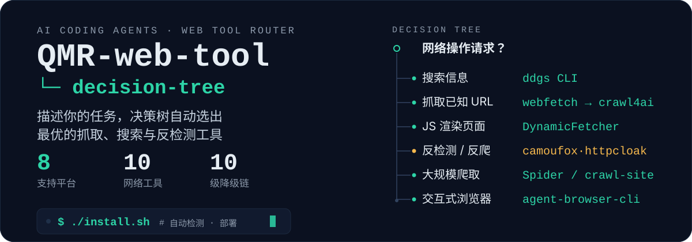
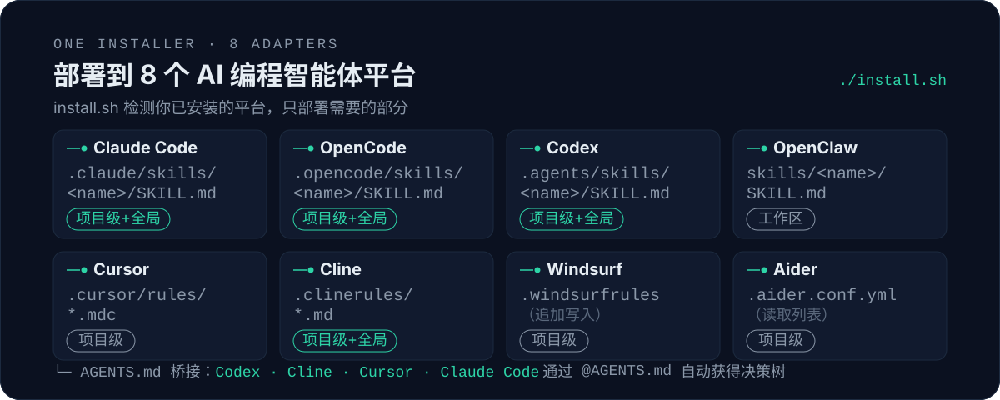

<p align="center">
  
</p>

<p align="center">
  
  &nbsp;
  
  &nbsp;
  
  &nbsp;
  
</p>

# QMR-web-decision-tree

> **Intelligent Web Tool Decision Tree for AI Coding Agents**
>
> One skill to rule them all. Automatically selects the optimal web scraping,
> searching, crawling, and anti-detection tool based on your task description.

[中文版文档 →](README.zh-CN.md)

---

## The Problem

AI coding agents need to fetch web content constantly. But choosing the right
tool is confusing:

- **`webfetch`** — built-in, simple, but fails on any anti-bot protection
- **`scrapling`** — Fetcher? DynamicFetcher? StealthyFetcher? Which one?
- **`camoufox`** vs **`httpcloak`** — both bypass Cloudflare, but differently
- **`crawl4ai`** — great for LLM-optimized output, overkill for a single URL
- **`ddgs`** — search vs news vs images vs videos?

**QMR-web-tool** solves this with a decision tree: describe your task, and the
skill routes you to the correct tool with ready-to-use code snippets.

---

## Quick Start

```bash
git clone https://github.com/mechanic-Q/QMR-web-decision-tree.git
cd QMR-web-decision-tree
chmod +x install.sh && ./install.sh
```

That's it. The installer:
1. Detects which AI coding agents you have (Claude Code, OpenCode, Codex, etc.)
2. Installs all Python/Node.js dependencies
3. Deploys the skill to each agent's skill directory
4. Generates `AGENTS.md` for cross-platform compatibility

---

## Supported Platforms

| Platform | Format | Installed To |
|----------|--------|-------------|
| **Claude Code** | `.claude/skills/<name>/SKILL.md` | Project + global |
| **OpenCode** | `.opencode/skills/<name>/SKILL.md` | Project + global |
| **Codex** | `.agents/skills/<name>/SKILL.md` | Project + global |
| **OpenClaw** | `skills/<name>/SKILL.md` | Workspace |
| **Cursor** | `.cursor/rules/*.mdc` | Project |
| **Cline** | `.clinerules/*.md` | Project + global |
| **Windsurf** | `.windsurfrules` (appended) | Project |
| **Aider** | `.aider.conf.yml` (read list) | Project |

<p align="center">
  
</p>

### Cross-platform via AGENTS.md

All platforms that read `AGENTS.md` (Codex, Cline, Cursor, Claude Code via `@AGENTS.md`)
get the decision tree automatically.

---

## Tool Inventory

All tools are verified working:

| Tool | Type | Best For | Installed |
|------|------|----------|-----------|
| **scrapling** | Python lib | Universal fetch (HTTP + JS + Turnstile) | ✅ via pip |
| **camoufox** | Python lib | Anti-detection browser (C++ fingerprint spoofing) | ✅ via pip |
| **httpcloak** | Python lib | HTTP/2+3 TLS perfect simulation | ✅ via pip |
| **crawl4ai** | Python lib | LLM-optimized output, full-site crawl | ✅ via pip |
| **ddgs** | Python/CLI | DuckDuckGo search (text/news/images/video) | ✅ via pip |
| **camofox-browser** | Node.js | Multi-agent shared browser (REST API) | ✅ via npm |
| **Playwright** | Python/Node | Browser automation (DynamicFetcher) | ✅ via pip |

---

## Decision Tree

```
User requests web operation?
│
├─ 🔍 Search (no full page needed)
│   ├─ General web search → ddgs CLI
│   ├─ Multi-engine → multi-search-engine skill
│   ├─ Academic papers → arxiv skill
│   └─ RSS/Blog → blogwatcher skill
│
├─ 📄 Fetch known URL
│   ├─ Priority 1: webfetch (built-in, zero cost)
│   ├─ Priority 2: crawl4ai-skill (LLM-optimized)
│   ├─ Priority 3: scrapling Fetcher (CSS/XPath extract)
│   └─ API calls → scrapling Fetcher
│
├─ ⚡ JS-rendered page (SPA)
│   ├─ Simple wait → crawl4ai-skill --wait-until networkidle
│   ├─ Need selectors → scrapling DynamicFetcher
│   └─ Need interaction → DynamicFetcher + page_action
│
├─ 🛡️ Anti-detection / Anti-bot
│   ├─ Light (UA check) → scrapling Fetcher impersonate
│   ├─ Cloudflare Turnstile → scrapling StealthyFetcher
│   ├─ Bot Management (TLS fingerprint)
│   │   ├─ HTTP layer → httpcloak (JA3/JA4 + HTTP/2+3 + QUIC)
│   │   └─ Browser layer → camoufox (C++ spoofing)
│   └─ All failed → Archive.org → search cache
│
├─ 🕷️ Large-scale crawl
│   ├─ Single domain → scrapling Spider
│   ├─ Full site → crawl4ai-skill crawl-site
│   └─ Multi-domain → crawlee (Node.js, requires extra install)
│
└─ 🖱️ Interactive browser (sign-in, fill forms)
    ├─ Normal site → agent-browser-cli (Playwright-based)
    ├─ Anti-detection → camoufox Python
    └─ Multi-agent → camofox-browser (REST API)
```

---

## Tool Downgrade Chain

```
camoufox > httpcloak > StealthyFetcher > Fetcher(impersonate)
> DynamicFetcher > Fetcher > crawl4ai > webfetch
> Archive.org > search engine cache
```

When a tool fails, automatically fall back to the next in chain.

---

## Examples

```bash
# Simple page fetch
python3 examples/simple_scrape.py

# JS-rendered page
python3 examples/js_render.py

# Cloudflare bypass with fallback chain
python3 examples/cloudflare_bypass.py https://protected-site.com

# DuckDuckGo news search
bash examples/search_news.sh "artificial intelligence"

# Interactive browser via REST API
bash examples/interactive.sh
```

---

## Dependencies

### Python (requirements.txt)

```
scrapling>=0.4.0     — Web scraping framework
camoufox>=0.4.0      — Anti-detection browser (auto-installs Playwright)
httpcloak>=1.6.0     — HTTP/2+3 TLS fingerprint simulation
crawl4ai>=0.8.0      — LLM-optimized crawler
ddgs>=9.0.0          — DuckDuckGo search
pyyaml>=6.0          — YAML parser (used by Aider adapter)
```

### Node.js (package.json)

```
camofox-browser ^2.4.0  — Multi-agent shared browser REST API
```

> `agent-browser`  is available separately as a CLI tool. Install globally via `npm install -g agent-browser` if interactive browser automation is needed.

### Special Install Steps

After `pip install`, run these additional commands:

```bash
# Download camoufox browser binary (~300 MB)
python3 -m camoufox fetch

# Install Playwright browser
python3 -m playwright install chromium
```

---

## License

MIT © mechanic-Q

---

## FAQ

**Q: Do I need all tools?**
A: No. The decision tree automatically skips unavailable tools and falls back.

**Q: What if I only have one platform (e.g., only Claude Code)?**
A: The installer detects exactly your setup and deploys only where needed.

**Q: Chinese network issues?**
A: Use `pip install -i https://pypi.tuna.tsinghua.edu.cn/simple` for pip.
Browser binary downloads may need a proxy.

**Q: Can I contribute a new tool to the decision tree?**
A: Yes! Add it to the SKILL.md, update the downgrade chain, and submit a PR.
